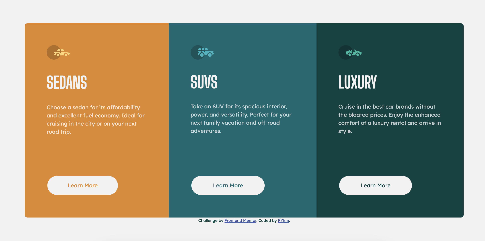

# Frontend Mentor - 3-column preview card component solution

This is a solution to the [3-column preview card component challenge on Frontend Mentor](https://www.frontendmentor.io/challenges/3column-preview-card-component-pH92eAR2-). Frontend Mentor challenges help you improve your coding skills by building realistic projects.

## Table of contents

- [Overview](#overview)
  - [The challenge](#the-challenge)
  - [Screenshot](#screenshot)
  - [Links](#links)
- [My process](#my-process)
  - [Built with](#built-with)
  - [What I learned](#what-i-learned)
  - [Continued development](#continued-development)
  - [Useful resources](#useful-resources)
- [Author](#author)

## Overview

### The challenge

Users should be able to:

- View the optimal layout depending on their device's screen size
- See hover states for interactive elements

### Screenshot




### Links

- Solution URL: [on Frontend Mentor](https://www.frontendmentor.io/solutions/3column-preview-card-component-OxP1AdSCl2)
- Live Site URL: [on Github](https://pykm.github.io/3-column-preview-card/)

## My process

### Built with

- Semantic HTML5 markup
- CSS custom properties
- Flexbox
- Mobile-first workflow

### What I learned

Use `border-radius` and  `overflow: hidden;` to apply border-radius to the container.

To see how you can add code snippets, see below:

```html
<main>
  <article></article>
  <article></article>
  <article></article>
</main>
```
```css
main{
  border-radius: 0.5em;
  overflow: hidden;
}
```

### Continued development

Technique that I'm not completely familiar with, can be found in this challenge:
- Add `border-radius` and  `overflow: hidden;` to the container to deal with the `border-radius` not working issue.

Technique that I found useful, although not using in this challenge:
- SASS

### Useful resources

- [Container border-radius not applied on bricks](https://forum.bricksbuilder.io/t/apply-overflow-hidden-property-when-using-borders-radiuses/184) - This helped me to understand why children elements bleed out the container, and how to solve the problem.

## Author

- Website - [PYkm](https://pykm.github.io/)
- Frontend Mentor - [@PYkm](https://www.frontendmentor.io/profile/PYkm)
